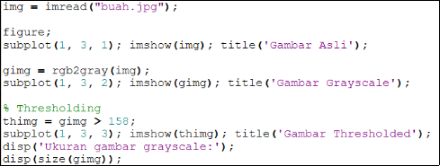
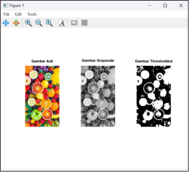
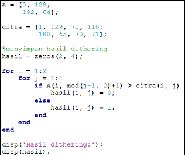
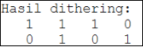

**PEMROGRAMAN CITRA DIGITAL**

Tugas 3: Detail Halftoning: Pola & Detail

Disusun Oleh :

|Sarah Amalia|(2310131320008)|
| :- | -: |

**Dosen Pembimbing :**

Dr. Harja Santana Purba, M.Kom Novan Alkaf Bahraini Saputra, S.Kom., M.T

**PROGRAM STUDI PENDIDIKAN KOMPUTER**

**FAKULTAS KEGURUAN DAN ILMU PENDIDIKAN**

**UNIVERSITAS LAMBUNG MANGKURAT**

**BANJARMASIN**

**2024**

# **DAFTAR ISI**

#
[DAFTAR ISI	2](#_toc178156696)

[PENDAHULUAN	3](#_toc178156697)

[PEMBAHASAN	4](#_toc178156698)

[A.	Halftoning	4](#_toc178156699)

[B.	Patterning	4](#_toc178156700)

[C.	Dithering	6](#_toc178156701)

[DAFTAR PUSTAKA	8](#_toc178156702)

# **PENDAHULUAN**

Dalam pemrosesan citra digital, halftoning merupakan teknik penting yang digunakan untuk merepresentasikan citra grayscale dengan hanya dua warna (biasanya hitam dan putih). Halftoning bekerja dengan menciptakan ilusi gradasi warna abu-abu melalui pola titik-titik hitam dan putih yang diatur dalam ukuran dan jarak tertentu. Meskipun gambar yang dihasilkan secara teknis hanya menggunakan dua warna, tetapi memungkinkan manusia untuk melihatnya sebagai gambar dengan berbagai tingkatan kecerahan. Dalam tugas ini, kita akan mempelajari dua metode utama halftoning: patterning dan dithering, di mana patterning menggunakan pola teratur untuk menggambarkan intensitas, sementara dithering menghasilkan hasil lebih halus dengan pola acak yang lebih kompleks.

# **PEMBAHASAN**

1. ## **Halftoning**
   Halftoning adalah proses yang mensimulasikan corak abu-abu dengan memvariasikan ukuran titik-titik hitam kecil yang tersusun dalam pola yang teratur. Teknik ini digunakan dalam percetakan, Jika memeriksa foto di koran, maka akan melihat bahwa gambar tersebut tersusun dari titik-titik hitam meskipun tampak tersusun dari abu-abu. Hal ini dimungkinkan karena integrasi spasial yang dilakukan oleh mata kita. Mata kita memadukan detail-detail halus dan merekam intensitas keseluruhan.

1. ## **Patterning**
   Patterning adalah metode dasar dalam teknik halftoning yang bertujuan untuk menghasilkan gambar biner (hitam dan putih) dari gambar grayscale. Metode ini berfungsi dengan menggunakan pola-pola tetap (pattern) untuk menggantikan nilai intensitas grayscale pada gambar asli. Setiap nilai pixel grayscale dikonversi menjadi pola titik hitam atau putih yang diatur dalam bentuk grid. Patterning lebih sederhana dibanding metode seperti dithering karena menggunakan pola yang teratur dan berulang.

**Langkah – langkah dalam patterning**

1. Pola yang digunakan

||||||
| :- | :- | :- | :- | :- |

||||
| :- | :- | :- |
||||
||||

|`           `(0)|||||
| :- | :- | :- | :- | :- |

||||
| :- | :- | :- |
||||
||||

||`           `(1)||||
| :- | :- | :- | :- | :- |

||||
| :- | :- | :- |
||||
||||

|||`           `(2)|||
| :- | :- | :- | :- | :- |

||||
| :- | :- | :- |
||||
||||

||||`           `(3)||
| :- | :- | :- | :- | :- |

||||
| :- | :- | :- |
||||
||||

|||||`           `(4)|
| :- | :- | :- | :- | :- |
||||||

||||
| :- | :- | :- |
||||
||||

|`           `(5)|||||
| :- | :- | :- | :- | :- |

||||
| :- | :- | :- |
||||
||||

||`           `(6)||||
| :- | :- | :- | :- | :- |

||||
| :- | :- | :- |
||||
||||

|||`           `(7)|||
| :- | :- | :- | :- | :- |

||||
| :- | :- | :- |
||||
||||

||||`           `(8)||
| :- | :- | :- | :- | :- |

||||
| :- | :- | :- |
||||
||||

|||||`           `(9)|
| :- | :- | :- | :- | :- |

1. Pembagian grayscale kedalam pola 

   Pada gambar grayscale 8-bit, terdapat 256 tingkatan warna, mulai dari 0 hingga 255. Untuk membagi rentang nilai grayscale ini, kita bisa menggunakan pembagian 256/10, yang menghasilkan 26. Jadi, setiap pola akan mencakup 26 nilai.

   Rentang nilai untuk setiap pola dihitung sebagai berikut:

- Pola (0) → 0 - 25 
- Pola (1) → 26 - 51
- Pola (2) → 52 - 77
- Pola (3) → 78 - 103
- Pola (4) → 104 - 129
- Pola (5) → 130 - 155
- Pola (6) → 156 - 181
- Pola (7) → 182 - 207
- Pola (8) → 208 - 233
- Pola (9) → 234 -255

  Penjelasan:

  Pola pertama mulai dari 0 dan berakhir di 25. 

  Pola berikutnya selalu dimulai dari angka setelah pola sebelumnya berakhir, lalu ditambah 25.

1. Proses dan output

||||
| - | - | - |

|129|170|
| :-: | :-: |
|200|45|

|Data awal yang akan diproses|Setiap angka yang ada pada data awal, masuk kepola berapa||
| - | - | - |

|4|6|
| :-: | :-: |
|7|1|

||

|Menggambarkan pola  4, 6, 7, 1 dalam ukuran 6x6|
| - | - | - |

|||||||
| - | - | - | - | - | - |
|||||||
|||||||
|||||||
|||||||
|||||||

||||
| - | - | - |

**Algoritma patterning:**

1. Menentukan rentang nilai untuk setiap pola berdasarkan pembagian 256 menjadi 10 bagian, setiap bagian memiliki 26 nilai.
1. Input data grayscale 8 bit
1. Tentukan pola berdasarkan nilai
1. Proses pembuatan pola patterning 
1. Hasil akhir 

**Code Program** 

**Output**

1. ## **Dithering** 
   Dithering digunakan dalam grafik komputer untuk menciptakan ilusi "kedalaman warna" dalam gambar dengan palet warna terbatas - teknik yang juga dikenal sebagai kuantisasi warna. Dalam gambar dithering, warna yang tidak tersedia dalam palet didekati dengan difusi piksel berwarna dari dalam palet yang tersedia. Mata manusia melihat difusi sebagai campuran warna di dalamnya (lihat penglihatan warna). Gambar dithering, terutama yang memiliki warna yang relatif sedikit, sering kali dapat dibedakan dengan karakteristik bintik-bintik atau tampilan berbintik.

**Langkah – langkah dalam dethering**

1. Menggunakan matriks 2x2

   A =  012819264  

1. Ada citra 2x4

|1|129|70|110|
| :-: | :-: | :-: | :-: |
|180|65|70|71|

1. Membandingkan setiap elemen dari matriks A dengan nilai piksel dari citra 2x4. 

|0 < 1|128 < 192|0 < 70|128 > 110|
| :-: | :-: | :-: | :-: |
|192 > 180|64 < 65 |192 > 70|64 < 71|

Perhitungan:

Matriks A >  nilai piksel dari citra maka = white 	 →  	white bernilai = 0

Matriks A < dari nilai piksel citra maka = black 	 →   	black bernilai = 1

1. Hasil akhir

|1|1|1|0|
| :-: | :-: | :-: | :-: |
|0|1|0|1|

**Algoritma Dithering**

1. Inisialisasi matriks
1. Input nilai piksel dari citra
1. Proses perbandinagan 
- setiap elemen matriks A dengan nilai piksel pada citra 2x4
- Jika elemen matriks A lebih besar dari nilai piksel citra maka 0 (white)
- Jika elemen matriks A lebih kecil atau sama dengan nilai piksel maka 1 (black)
1. Hasil akhir 

**Code Program**

**Output**

# **DAFTAR PUSTAKA**

A.Bouman, Digital Processing.(2024). <https://engineering.purdue.edu/~bouman/ece637/notes/pdf/Halftoning.pdf>

Digital Image Processing Laboratory: Image Haltoning.(2011), Purdue University

Septiana Lina.(2013) Halfoning Citra Menggunakan Metode Ordered Dithering, Jurnal Teknik dan Ilmu Komputer, Vol. 02(07), 237-241

2

